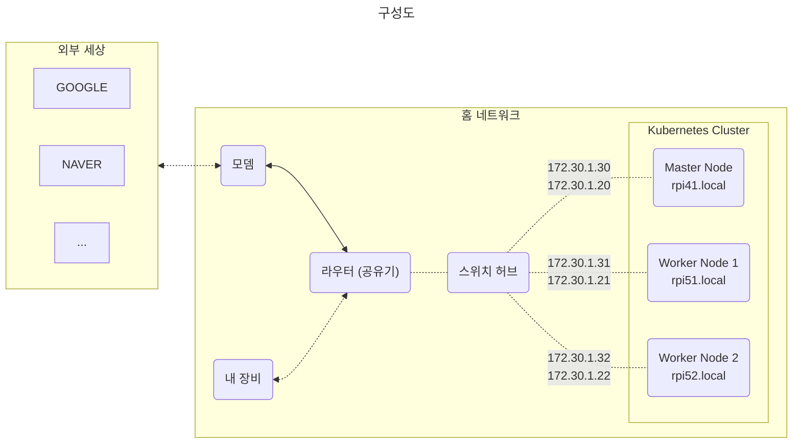

# 1. 하드웨어 구성
1대의 마스터노드와 2대의 워커노드로 구성한다.
|  |Master Node|Worker Node|  
|--|-----------|-----------|  
|모델|Raspberry Pi 4|Raspberry Pi 5|  
|RAM|4G|8G|
|수량|1ea|2ea|

### 노드별 호스트 네임과 네트워크 설정
* 아이피는 유/무선 아이피를 고정 할당 한다.
* 호스트 네임은 ```rpi```를 prefix, ```.local```을 suffix로 한다.
  * 라즈베리파이 세대와 해당 노드의 순서를 조합하여 생성한다.
  * ex. Worker Node 1은 라즈베리파이 5세대이고 첫번째 노드이므로 ```rpi51.local```

|  |호스트 네임|유선 (eth0)|무선 (wlan0)|
|--|-------|---|---|
|Master Node|rpi41.local|172.30.1.30|172.30.1.20|
|Worker Node 1|rpi51.local|172.30.1.31|172.30.1.21|
|Worker Node 2|rpi52.local|172.30.1.32|172.30.1.22|


  
### 결과물
  


## **[목차](./README.md#목차)**  
