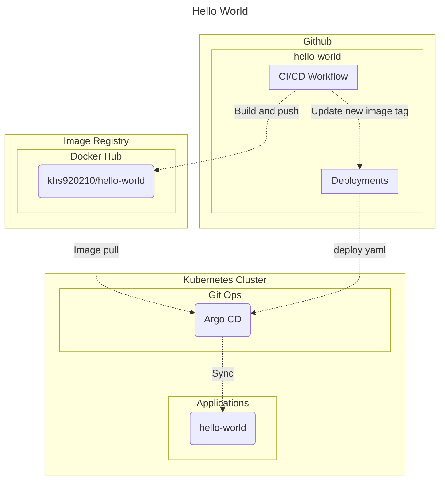
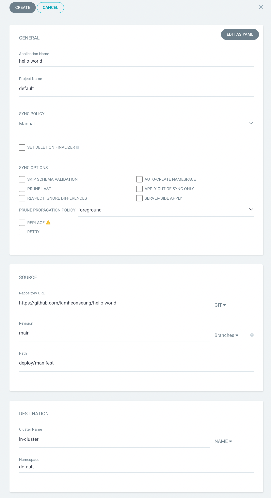
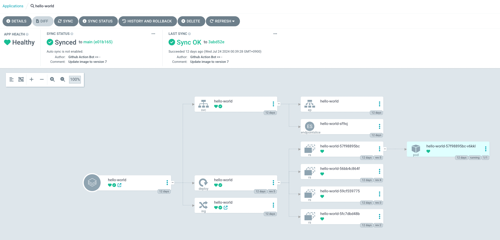

# 7. hello-world 어플리케이션 배포해보기
### hello-world 어플리케이션
https://github.com/kimheonseung/hello-world

```mermaid
---
title: Hello World
---
flowchart TB

    subgraph IMAGE_REGISTRY["Image Registry"];
        subgraph DOCKERHUB["Docker Hub"]
            IMAGE("khs920210/hello-world")
        end
    end
    
    subgraph GITHUB["Github"]
        direction TB
        subgraph APP["hello-world"]
            subgraph DEPLOY["Deployments"]
            end
            subgraph WORKFLOW["CI/CD Workflow"]
            end
        end
    end
    
    subgraph K8S["Kubernetes Cluster"]
        subgraph GIT_OPS["Git Ops"]
            ARGOCD("Argo CD")
        end
        subgraph APPS["Applications"]
            HELLO_WORLD("hello-world")
        end
    end

    IMAGE -.-> |"Image pull"| ARGOCD
    DEPLOY -.-> |"deploy yaml"| ARGOCD
    ARGOCD -.-> |"Sync"| HELLO_WORLD
    WORKFLOW -.-> |"Build and push"| IMAGE
    WORKFLOW -.-> |"Update new image tag"| DEPLOY
    
    click IMAGE href "https://hub.docker.com/r/khs920120/hello-world/tags" "dockerhub image tags"
    click DEPLOY href "https://github.com/kimheonseung/hello-world/blob/main/deploy/manifest/deployment.yaml#L26" "deployments yaml"
    click WORKFLOW href "https://github.com/kimheonseung/hello-world/blob/main/.github/workflows/ci-cd-hello-world.yaml" "ci/cd yaml"
```

### ArgoCD에 레파지토리 등록

### ArgoCD 배포 확인

**[목차](./README.md#목차)**  
