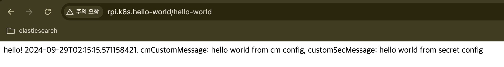

# 9. ConfigMap, Secret으로 Spring 어플리케이션 설정 주입
### [Spring Cloud Kubernetes](https://spring.io/projects/spring-cloud-kubernetes)
- K8S 환경에서 Spring 어플리케이션을 통합할 수 있게 해준다.
  - 서비스 레지스트리
    - 어플리케이션 설정에 namespace, service 명을 그대로 활용 가능
  - ConfigMap, Secret 통합
    - 어플리케이션 설정 및 환경변수에 ConfigMap, Secret 등의 값 주입할 수 있음
  - Health Probe 연동
    - livenessProbe, readinessProbe와 Spring Actuator 연동 가능
    - 연동을 하지 않으면 어플리케이션 컨테이너에 직접 접근이 어려워 프록시를 거쳐야함 (Ingress 등)
  - 그 외에도 로드밸런싱 등을 지원한다.

### To Do
  - ConfigMap, Secret 통합
  - Health Probe 연동
  - namespace 연동

### 라이브러리 추가
  ```gradle
  ...
  extra["springCloudVersion"] = "2023.0.3"
  ...
  dependencies {
      implementation("org.springframework.cloud:spring-cloud-starter-kubernetes-client")
      // health probe와 연동 확인
      implementation("org.springframework.boot:spring-boot-starter-actuator")
  }
  ...
  dependencyManagement {
      imports {
          mavenBom("org.springframework.cloud:spring-cloud-dependencies:${property("springCloudVersion")}")
      }
  }
  ```

### 주입받을 값을 출력하는 컨트롤러 정의
- ```cm.custom.message```
  - ConfigMap에서 가져올 설정값
- ```sec.custom.message```
  - Secret에서 가져올 설정값
```kotlin
import org.springframework.beans.factory.annotation.Value
import org.springframework.web.bind.annotation.GetMapping
import org.springframework.web.bind.annotation.RequestMapping
import org.springframework.web.bind.annotation.RestController
import java.time.LocalDateTime

@RestController
@RequestMapping("/hello-world")
class HelloWorldController(
    @Value("\${cm.custom.message}")
    val customMessage: String,
    @Value("\${sec.custom.message}")
    val customSecMessage: String,
) {
    @GetMapping
    fun getHelloWorld() = "hello! ${LocalDateTime.now()}. cmCustomMessage: $customMessage, customSecMessage: $customSecMessage"
}
```

### yaml 설정
  - Spring Cloud Kubernetes 라이브러리를 추가한 뒤 어플리케이션을 구동하면 kuberentes 프로파일로 구동한다.
    ```bash
    2024-09-23T01:50:01.199Z  INFO 1 --- [hello-world] [  main] c.k.h.HelloWorldApplicationKt   : The following 1 profile is active: "kubernetes"
    ```
  - 기본 프로파일용 yaml과 kubernetes 프로파일용 yaml 두가지를 설정해본다.
  - application.yaml  
    ```yaml
    spring:
      application:
        name: hello-world
    management:
      endpoints:
        web:
          exposure:
            include: health # health probe가 요청할 actuator path 설정
    ```
  - application-kubernetes.yaml  
    ```yaml
    spring:
      cloud:
        kubernetes:
          discovery:
            all-namespaces: false
            namespaces: raskub-app # 어플리케이션의 네임스페이스를 raskub-app으로 제한한다.  
    sec:
      custom:
        message: ${SECURITY_MESSAGE} # Secret에서 가져올 값을 명시한다.
    ```

### Manifest 작성
- Spring 어플리케이션 배포 상태를 정의한다.  
  1. ConfigMap, Secret을 정의한다.
  2. 위와 관련된 Role을 정의한다.
      - 특정 namespace 기준이라 Cluster Role 대신 Role 정의
  3. Service Account를 정의한다.
  3. 위 Role과 Service Account와 관련된 Role Binding을 정의한다.
  4. Service, Ingress를 정의한다.
  5. Deployment를 정의한다.

#### ConfigMap
  ```yaml
  apiVersion: v1
  kind: ConfigMap
  metadata:
    name: hello-world-config
    namespace: raskub-app
  data:
    application.yaml: |-
      cm:
        custom:
          message: hello world from cm config
  ```
#### Secret
  ```yaml
  apiVersion: v1
  kind: Secret
  metadata:
    name: hello-world-secret
    namespace: raskub-app
  stringData:
    sec_message: hello world from secret config
  ```
#### Role
  ```yaml
  apiVersion: rbac.authorization.k8s.io/v1
  kind: Role
  metadata:
    namespace: raskub-app
    name: hello-world-reader
  rules:
    - apiGroups: [""]
      resources: ["pods", "configmaps", "secrets", "services", "endpoints"]
      verbs: ["get", "watch", "list"]
  ```
#### Service Account
  ```yaml
  apiVersion: v1
  kind: ServiceAccount
  metadata:
    name: hello-world-sa
    namespace: raskub-app
  ```
#### Service
  ```yaml
  apiVersion: v1
  kind: Service
  metadata:
    name: hello-world
    namespace: raskub-app
    labels:
      app: hello-world
  spec:
    ports:
      - port: 8080
        protocol: TCP
        targetPort: 8080
    selector:
      app:  hello-world
    type: ClusterIP
  ```
#### Ingress
  ```yaml
  apiVersion: networking.k8s.io/v1
  kind: Ingress
  metadata:
    name: hello-world
    namespace: raskub-app
    annotations:
      kubernetes.io/ingress.class: "traefik"
  spec:
    rules:
      - host: rpi.k8s.hello-world
        http:
          paths:
            - path: /
              pathType: Prefix
              backend:
                service:
                  name: hello-world
                  port:
                    number: 8080
  ```
#### Deplyment
  ```yaml
  apiVersion: apps/v1
  kind: Deployment
  metadata:
    labels:
      app: hello-world
    name: hello-world
    namespace: raskub-app
  spec:
    revisionHistoryLimit: 5
    strategy:
      type: RollingUpdate
      rollingUpdate:
        maxSurge: 50%
        maxUnavailable: 0%
    selector:
      matchLabels:
        app: hello-world
    template:
      metadata:
        labels:
          app: hello-world
      spec:
        serviceAccount: hello-world-sa
        securityContext:
          fsGroup: 65534
        containers:
          - name: hello-world
            image: khs920210/hello-world:6
            imagePullPolicy: IfNotPresent
            env:
              - name: SECURITY_MESSAGE # Secret 값 주입
                valueFrom:
                  secretKeyRef:
                    name: hello-world-secret
                    key: sec_message
            ports:
              - name: http
                protocol: TCP
                containerPort: 8080
            resources:
              limits:
                memory: 500Mi
              requests:
                cpu: 300m
                memory: 500Mi
            readinessProbe: # Health Probe와 Actuator 연동
              httpGet:
                path: /actuator/health/readiness
                port: 8080
              initialDelaySeconds: 10
              periodSeconds: 10
            livenessProbe: # Health Probe와 Actuator 연동
              httpGet:
                path: /actuator/health/liveness
                port: 8080
              initialDelaySeconds: 120
              periodSeconds: 10
            volumeMounts:
              - name: config-volume
                mountPath: /opt/hello-world/config # ConfigMap 주입. volume은 따로 정의한다.
        volumes:
          - name: config-volume # ConfigMap Volume
            configMap:
              name: hello-world-config
  ```

### 확인


### Git Repo
https://github.com/kimheonseung/hello-world


## **[목차](./README.md#목차)**  
