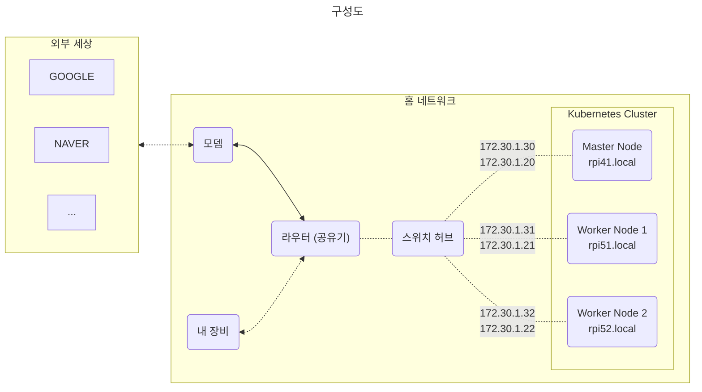
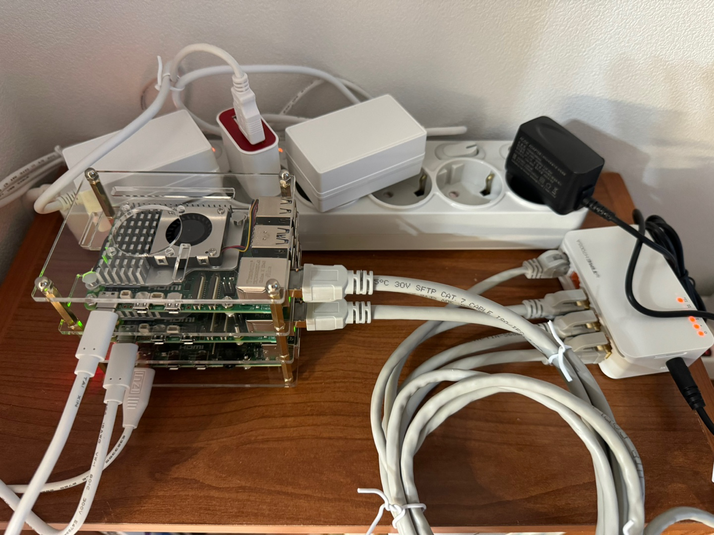

# RASKUB

라즈베리 파이를 활용하여 쿠버네티스 클러스터 구축해보기  
**RAS**pberrypi **KUB**ernetes &rarr; RASKUB  

# 목차
[0. 배경](#0-배경)  
[1. 하드웨어 구성](#1-하드웨어-구성)  
[2. k3s 설치 및 클러스터 세팅](#2-k3s-설치-및-클러스터-세팅)  
[3. Master Node에 helm 설치](#3-master-node에-helm-설치)  
[4. kubernetes dashboard 구성](#4-kubernetes-dashboard-구성)  
[5. plex media server 구성](#5-plex-media-server-구성)  
[6. ArgoCD 구성](#6-argocd-구성)  
[7. hello-world 어플리케이션 배포해보기](#7-hello-world-어플리케이션-배포해보기)  


# 0. 배경
* 3대의 라즈베리 파이를 다음 용도로 활용 중이었다.
  * Plex Media Server
  * NFS
  * 개발 공부에 필요한 인프라 등
* 점점 여러 대의 디바이스를 관리하기도 귀찮고, 문득 쿠버네티스 환경으로 이전을 해보고 싶다는 생각이 들었다.
* 기기가 넉넉하진 않지만 3대면 클러스터링을 해볼 수 있지 않을까?  
  
  
# 1. 하드웨어 구성
1대의 마스터노드와 2대의 워커노드로 구성한다.
|  |Master Node|Worker Node|  
|--|-----------|-----------|  
|모델|Raspberry Pi 4|Raspberry Pi 5|  
|RAM|4G|8G|
|수량|1ea|2ea|

### 노드별 호스트 네임과 네트워크 설정
* 아이피는 유/무선 아이피를 고정 할당 한다.
* 호스트 네임은 ```rpi```를 prefix, ```.local```을 suffix로 한다.
  * 라즈베리파이 세대와 해당 노드의 순서를 조합하여 생성한다.
  * ex. Worker Node 1은 라즈베리파이 5세대이고 첫번째 노드이므로 ```rpi51.local```

|  |호스트 네임|유선 (eth0)|무선 (wlan0)|
|--|-------|---|---|
|Master Node|rpi41.local|172.30.1.30|172.30.1.20|
|Worker Node 1|rpi51.local|172.30.1.31|172.30.1.21|
|Worker Node 2|rpi52.local|172.30.1.32|172.30.1.22|


  
### 결과물
  
  
     
# 2. k3s 설치 및 클러스터 세팅
### 공통 세팅
* cgroup 설정
  * 컨테이너별 리소스 사용 배분을 위해 설정한다.
    ```bash
    $ sudo vi /boot/firmware/cmdline.txt
    ... cgroup_enable=cpuset cgroup_memory=1 cgroup_enable=memory
    ```
* swap off
  * 디스크 I/O 성능 저하 발생
  * cgroup 외에도 메모리 관여 포인트가 늘어남
    ```bash
    # 임시 off
    $ sudo swapoff -a
    # 영원히 off
    $ sudo vi /etc/dphys-swapfile
    CONF_SWAPSIZE=0
    ```
* 일단 무선랜 사용 off
  ```bash
  # 리부팅마다 해줘야 함
  $ sudo ifconfig wlan0 down
  $ sudo rfkill block $WLAN_ID
  ```
* apt 업데이트 / 업그레이드
  ```bash
  $ sudo apt update
  $ sudo apt upgrade
  ```
* hostname 등록
  ```bash
  # /etc/hosts
  172.30.1.20     rpi41.local
  172.30.1.30     rpi41.local

  172.30.1.21     rpi51.local
  172.30.1.31     rpi51.local

  172.30.1.22     rpi52.local
  172.30.1.32     rpi52.local
  ```

---
### k3s 설치
* 여러 설치 옵션이 있지만, 일단 기본값으로 설치한다.
  * ingress controller나 flannel backend 등의 [옵션](https://docs.k3s.io/kr/installation/configuration)을 커스터마이징 할 수 있음

* Master Node (rpi41.local)
  ```bash
  $ curl -sfL https://get.k3s.io | sh -

  # 설치 완료 후 노드 토큰 조회
  $ sudo cat /var/lib/rancher/k3s/server/node-token
  K10251e60ba702f29456c2c2d49031a752f03eb6014b134dddc2c368d1b4bcb1c36::server:278c5377975fed99a9c7e142c75602b3
  ```

* Worker Node (rpi51.local, rpi52.local)
  ```bash
  $ sudo vi /etc/profile
  # k3s
  K3S_URL="https://rpi41.local:6443"
  K3S_TOKEN="K10251e60ba702f29456c2c2d49031a752f03eb6014b134dddc2c368d1b4bcb1c36::server:278c5377975fed99a9c7e142c75602b3"
  export K3S_URL
  export K3S_TOKEN

  $ curl -sfL https://get.k3s.io | K3S_URL=$K3S_URL K3S_TOKEN=$K3S_TOKEN sh -
  ```

# 3. Master Node에 helm 설치
Wrting...

# 4. kubernetes dashboard 구성
Wrting...

# 5. plex media server 구성
Wrting...

# 6. ArgoCD 구성
Wrting...

# 7. hello-world 어플리케이션 배포해보기
Wrting...
